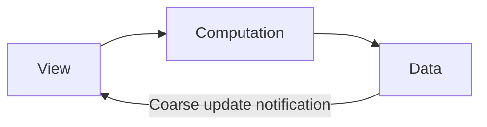
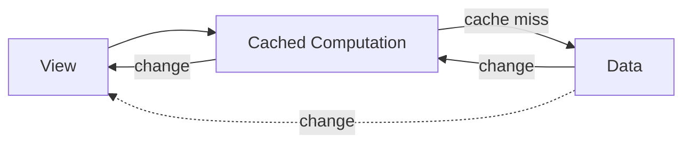

# ObservationMacros

> [!WARNING]
> This is a shower thought. Please don't use this.

## Background

Functional user interfaces inevitably result in a graph of computed
values. Some values are too expensive to compute per render, but not
expensive enough to make async and render intermediate value-missing
states. In React there are demand driven graphs flowing from view to
data with optional cuts via useMemo. Demand driven graphs respond to
data changes, but always traverse from view to data, like a giant
reverse edge completing a cycle. In c2 or Combine there are update
driven graphs flowing from data to view with optional cuts. SwiftUI,
like React, is a demand driven graph, but with no standard primitive
for cutting unnecessary computation.

## Solution

This package uses only `Observation` and implements a macro called
`@ObservationDerived`. It does not rely on SwiftUI and can be used in
plain `@Observable` viewmodels. It uses a cache to cut the computation
with explicit invalidation via `withObservationTracking`. This
structure forms a subgraph that strongly resembles regular data flow.

## Graphical Explanation

A typical SwiftUI data flow looks like this.

Augmented data flow

The dotted arrow is only present when the cached value is computed.
Renders that are cut at the cache will lose this dependency.

## Alternatives you should use instead

1. Smaller views to let SwiftUI manage rerendering.

2. `.onChange(of:initial:_)`, computing derived values in the view, or
   passing the responsibility to a viewmodel.

3. `DynamicProperty` with internal caching
